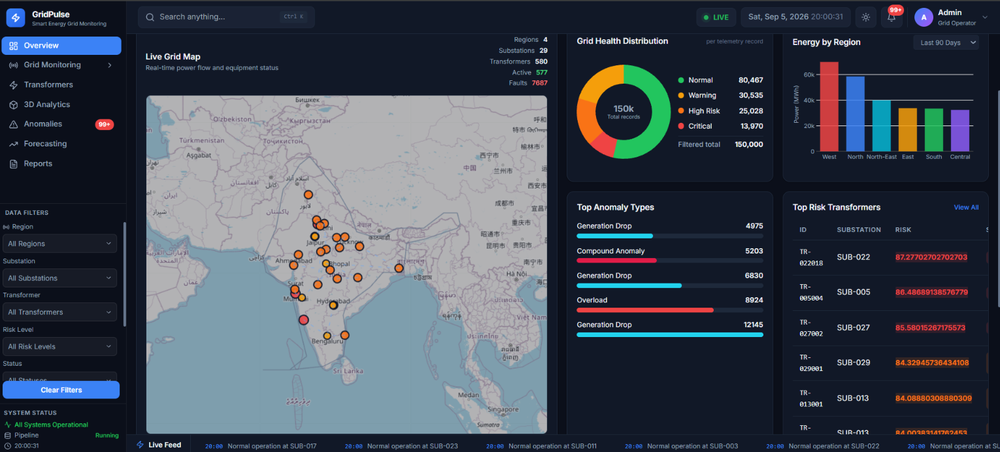
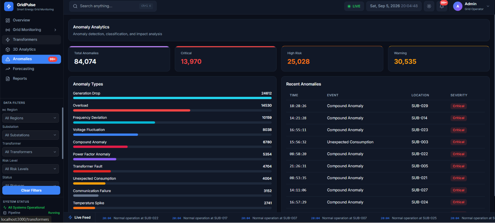
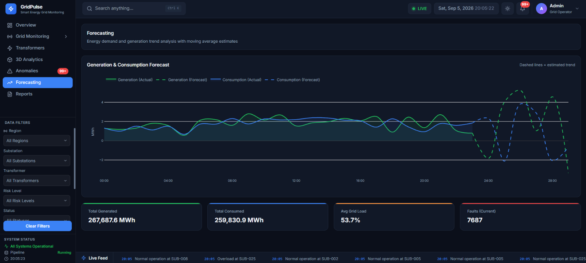

# ⚡ GridPulse — Smart Energy Grid Monitoring & Predictive Failure Analytics
# 📸 Project Screenshots

---

## ☀️ Overview — Bright Mode

<p align="center">

  

</p>

-----
## 🏠 Main Dashboard

<p align="center">

  

</p>
---

# 🗺️ Grid Monitoring

Grid Monitoring provides an operational and geographical view of the electrical grid.

---

## 🗺️ Live Grid Map

The Live Grid Map displays:

- Substations

- Transformer locations

- Grid connections

- Regional information

- Transformer status

- Risk information

- Live grid activity

<p align="center">

  

</p>

---

## ⚙️ Equipment Status

The Equipment Status section provides detailed transformer information.

It can display:

- Transformer ID

- Substation

- Region

- Load

- Temperature

- Voltage

- Current

- Power

- Power Factor

- Frequency

- Energy Generated

- Energy Consumed

- Communication Latency

- Fault Indicator

- Anomaly Type

- Risk Score

- Status

<p align="center">

  

</p>

---

## ⚡ Power Flow

Power Flow compares energy generation and consumption.

It helps analyze:

- Energy production

- Energy consumption

- Demand patterns

- Generation-consumption differences

- Regional energy behavior

<p align="center">

  

</p>


<p align="center">

  

</p>

<h3 align="center">

  AI-Powered Smart Energy Grid Monitoring, Anomaly Detection & Predictive Failure Analytics

</h3>

<p align="center">

  

  

  

  

  

  

</p>

---

## 📌 Project Overview

**GridPulse** is a Smart Energy Grid Monitoring and Predictive Failure Analytics platform designed to monitor large-scale electrical grid telemetry data.

The platform combines:

- Big Data Processing

- Apache PySpark

- Real-Time Telemetry

- Anomaly Detection

- Risk Scoring

- Predictive Failure Analytics

- Interactive Data Visualization

- 3D Analytical Visualization

- REST APIs

- WebSocket-Based Live Monitoring

GridPulse processes **150,000+ smart-grid telemetry records** and converts raw energy data into meaningful operational insights.

The system helps identify:

- Transformer Overload

- Voltage Fluctuation

- Temperature Spikes

- Frequency Deviation

- Power Factor Anomalies

- Communication Failures

- Generation Drops

- Unexpected Consumption

- Transformer Faults

- Compound Anomalies

---

# 🎯 Project Objectives

The main objectives of GridPulse are:

1. Monitor electrical grid telemetry in real time.

2. Process large-scale energy data using PySpark.

3. Detect abnormal grid behavior.

4. Calculate transformer and grid risk scores.

5. Identify high-risk transformers.

6. Compare energy generation and consumption.

7. Monitor grid health across different regions.

8. Provide an interactive monitoring dashboard.

9. Visualize relationships using 3D analytics.

10. Support predictive maintenance and future failure prediction.

---

# 🏗️ System Architecture

```text

                    ┌─────────────────────────┐

                    │     Telemetry Data      │

                    │      150K+ Records      │

                    └────────────┬────────────┘

                                 │

                                 ▼

                    ┌─────────────────────────┐

                    │        PySpark          │

                    │    Big Data Engine      │

                    └────────────┬────────────┘

                                 │

                                 ▼

                    ┌─────────────────────────┐

                    │        BRONZE           │

                    │       Raw Data           │

                    └────────────┬────────────┘

                                 │

                                 ▼

                    ┌─────────────────────────┐

                    │        SILVER           │

                    │ Cleaned & Validated Data│

                    └────────────┬────────────┘

                                 │

                                 ▼

                    ┌─────────────────────────┐

                    │   Anomaly Detection    │

                    │     & Risk Scoring      │

                    └────────────┬────────────┘

                                 │

                                 ▼

                    ┌─────────────────────────┐

                    │          GOLD           │

                    │    Analytics Data       │

                    └────────────┬────────────┘

                                 │

                ┌────────────────┴────────────────┐

                │                                 │

                ▼                                 ▼

      ┌───────────────────┐             ┌───────────────────┐

      │      FastAPI      │             │     WebSocket     │

      │     REST APIs     │             │   Live Telemetry  │

      └─────────┬─────────┘             └─────────┬─────────┘

                │                                 │

                └────────────────┬────────────────┘

                                 ▼

                    ┌─────────────────────────┐

                    │       Next.js           │

                    │     React Dashboard     │

                    └─────────────────────────┘

```

---

# 🛠️ Technology Stack

## Frontend

- Next.js

- React

- TypeScript / JavaScript

- CSS

- Plotly.js

- Interactive Charts

- Interactive 3D Analytics

- Responsive UI

- Light / Dark Mode

## Backend

- Python

- FastAPI

- REST APIs

- WebSockets

## Big Data

- Apache Spark

- PySpark

- Spark DataFrames

- Spark SQL

- Structured Streaming

## Data Processing

- Pandas

- NumPy

- PySpark

## Visualization

- Plotly

- Interactive 2D Charts

- Interactive 3D Charts

- Geographic Grid Visualization

---

# 📊 Dataset

GridPulse uses a large-scale synthetic smart-grid telemetry dataset containing **150,000+ records**.

Each record represents telemetry collected from a transformer or substation in the electrical grid.

## Dataset Fields

| Field | Description |

|---|---|

| `id` | Unique record identifier |

| `event_id` | Unique telemetry event |

| `timestamp` | Telemetry timestamp |

| `region` | Grid region |

| `substation_id` | Substation identifier |

| `transformer_id` | Transformer identifier |

| `voltage_kv` | Voltage level |

| `current_amp` | Current |

| `power_mw` | Electrical power |

| `frequency_hz` | Grid frequency |

| `load_percent` | Transformer load percentage |

| `power_factor` | Power factor |

| `temperature_c` | Transformer temperature |

| `energy_generated_mwh` | Energy generated |

| `energy_consumed_mwh` | Energy consumed |

| `outage_duration_min` | Outage duration |

| `communication_latency_ms` | Communication latency |

| `fault_indicator` | Fault indicator |

| `anomaly_score` | Calculated anomaly score |

| `risk_score` | Calculated risk score |

| `status` | Risk classification |

| `anomaly_type` | Detected anomaly category |

---

# 🌎 Grid Regions

GridPulse supports geographical analysis of different grid regions.

The dashboard supports filtering by:

- All Regions

- North

- South

- East

- West

Regional filtering affects the analytics displayed throughout the dashboard.

---

# 🚨 Anomaly Detection

GridPulse identifies different types of abnormal grid behavior.

## Supported Anomaly Types

- Voltage Fluctuation

- Overload

- Temperature Spike

- Frequency Deviation

- Power Factor Anomaly

- Transformer Fault

- Communication Failure

- Unexpected Consumption

- Generation Drop

- Compound Anomaly

Anomalies are identified using electrical and operational parameters including:

- Voltage

- Current

- Load

- Temperature

- Frequency

- Power Factor

- Energy Generation

- Energy Consumption

- Communication Latency

- Fault Indicators

---

# ⚠️ Risk Classification

Each telemetry record receives a risk score.

| Risk Score | Status |

|---:|---|

| 0 – 29 | 🟢 Normal |

| 30 – 49 | 🔵 Low |

| 50 – 69 | 🟡 Warning |

| 70 – 84 | 🟠 High Risk |

| 85 – 100 | 🔴 Critical |

The risk classification allows grid operators to quickly identify equipment requiring attention.

---

# 📊 Dashboard

The GridPulse dashboard provides a centralized view of grid health and operations.

The main dashboard contains:

- Total Telemetry

- Grid Health Distribution

- Energy by Region

- Top Anomaly Types

- Top Risk Transformers

- Power Generation vs Consumption

- Live Grid Map

- 3D Grid Analytics

- Recent Alerts

- Live Telemetry Feed

---

# ❤️ Grid Health Distribution

The Grid Health Distribution visualization categorizes telemetry records according to their risk level.

Categories include:

- Normal

- Warning

- High Risk

- Critical

The visualization responds to the selected global filters.

---

# 🌍 Energy by Region

Energy generation and consumption can be analyzed across different grid regions.

Regional analytics help identify:

- High-demand regions

- Low-generation regions

- Consumption patterns

- Generation patterns

- Regional energy imbalance

---

# 🚨 Top Anomaly Types

GridPulse aggregates detected anomalies to identify the most common grid problems.

Examples include:

- Voltage Fluctuation

- Overload

- Temperature Spike

- Frequency Deviation

- Power Factor Anomaly

- Generation Drop

- Transformer Fault

- Communication Failure

This helps grid operators prioritize recurring operational issues.

---

# 🔥 Top Risk Transformers

GridPulse ranks transformers based on their calculated risk score.

Operators can investigate:

- Transformer ID

- Substation

- Region

- Load

- Temperature

- Voltage

- Current

- Power

- Risk Score

- Status

- Anomaly Type

---

# 📈 Power Generation vs Consumption

GridPulse provides time-based comparison of energy generation and consumption.

The graph can be filtered by:

- Region

- Substation

- Transformer

- Risk Level

- Status

- Anomaly Type

- Time Range

This allows operators to analyze energy behavior for specific parts of the grid.

---

# 🧊 3D Grid Analytics

GridPulse provides interactive analytical 3D visualizations.

The 3D analytics focus on actual data relationships rather than a physical digital-twin simulation.

Possible analytical dimensions include:

```text

X → Load / Time

Y → Temperature / Voltage

Z → Risk Score / Power

```

The visualization can be used to identify relationships between:

- Load

- Temperature

- Voltage

- Power

- Risk

- Transformer behavior

<p align="center">

  

</p>

---

# 🚨 Anomalies Dashboard

The Anomalies page provides detailed information about detected abnormal events.

It can be used to investigate:

- Anomaly Type

- Transformer

- Substation

- Region

- Risk Score

- Timestamp

- Status

- Fault Information

<p align="center">

  

</p>

---

# 🔮 Forecasting

The Forecasting section provides analytical support for future grid behavior.

Potential forecasting applications include:

- Energy Demand

- Energy Consumption

- Power Generation

- Transformer Load

- Grid Risk

- Future Anomalies

<p align="center">

  

</p>

---

# 🔎 Global Filtering

GridPulse uses a centralized filtering architecture.

Available filters include:

```text

Region

Substation

Transformer

Risk Level

Status

Anomaly Type

Time Range

```

The same filtering system is used throughout the dashboard.

```text

                 Global Filters

                       │

                       ▼

                  Filter State

                       │

                       ▼

                    FastAPI

                       │

                       ▼

                  Gold Dataset

                       │

                ┌──────┴──────┐

                │             │

                ▼             ▼

            Filtering     Aggregation

                │             │

                └──────┬──────┘

                       ▼

                 JSON Response

                       │

                       ▼

                React Dashboard

                       │

          ┌────────────┼────────────┐

          ▼            ▼            ▼

         KPI         Charts       Tables

```

This ensures that dashboard components use consistent filtered data.

---

# 🔄 Real-Time Monitoring

GridPulse supports real-time telemetry monitoring using WebSocket communication.

```text

Telemetry Generator

        │

        ▼

FastAPI / WebSocket

        │

        ▼

Live Telemetry Stream

        │

        ▼

Next.js Dashboard

        │

        ▼

Real-Time Monitoring

```

The live monitoring system can update:

- Grid status

- Transformer information

- Alerts

- Telemetry

- Risk information

- Operational metrics

---

# 🏭 Bronze → Silver → Gold Data Pipeline

GridPulse follows a layered Big Data architecture.

## 🥉 Bronze Layer

The Bronze layer contains raw telemetry data.

```text

Raw Telemetry

      ↓

   Bronze

```

It preserves incoming data before analytical processing.

---

## 🥈 Silver Layer

The Silver layer performs data preparation.

Operations include:

- Data cleaning

- Missing-value handling

- Duplicate handling

- Type conversion

- Data validation

- Data standardization

```text

Bronze

   ↓

Cleaning

   ↓

Validation

   ↓

Silver

```

---

## 🥇 Gold Layer

The Gold layer contains analytics-ready data.

Processing includes:

- Anomaly Detection

- Risk Scoring

- Aggregations

- Transformer Analytics

- Regional Analytics

- Energy Analytics

```text

Silver

   ↓

Anomaly Detection

   ↓

Risk Scoring

   ↓

Aggregation

   ↓

Gold

```

---

# 🧠 Big Data Concepts Used

GridPulse demonstrates several Big Data concepts.

## 1. Large-Scale Data Processing

The system processes **150K+ telemetry records**.

## 2. Distributed Processing

PySpark is used for scalable data processing.

## 3. Data Pipeline

The system follows:

```text

Raw → Bronze → Silver → Gold

```

## 4. Data Cleaning

Data is cleaned and validated during the Silver stage.

## 5. Feature Engineering

Electrical and operational features are used to calculate:

- Anomaly Score

- Risk Score

- Transformer Health

## 6. Aggregation

Data is aggregated by:

- Region

- Substation

- Transformer

- Time

- Anomaly Type

- Risk Category

## 7. Streaming

WebSockets are used for live telemetry delivery.

## 8. Visualization

Processed Big Data is transformed into interactive visual analytics.

---

# 📁 Project Structure

```text

GridPulse/

│

├── data/

│   ├── raw/

│   ├── bronze/

│   ├── silver/

│   ├── gold/

│   ├── streaming/

│   └── exports/

│

├── data_generation/

│   ├── generate_data.py

│   └── ...

│

├── pipeline/

│   ├── bronze/

│   ├── silver/

│   ├── gold/

│   └── ...

│

├── analytics/

│   ├── anomaly_detection/

│   ├── risk_scoring/

│   ├── forecasting/

│   └── ...

│

├── backend/

│   ├── main.py

│   ├── api/

│   ├── services/

│   └── ...

│

├── dashboard/

│   ├── app/

│   ├── components/

│   ├── lib/

│   └── ...

│

├── screenshots/

│   ├── 3D Analytics.png

│   ├── Anomalies.png

│   ├── dashboard.png

│   ├── Forecasting.png

│   ├── Grid Monitoring-Equipment Status.png

│   ├── Grid Monitoring-Live Map.png

│   ├── Grid Monitoring-Power Flow.png

│   └── Overview Bright Mode.png

│

├── README.md

└── requirements.txt

```

---

# 🚀 Installation

## 1. Clone the Repository

```bash

git clone https://github.com/mash157/GridPulse.git

cd GridPulse

```

---

# 🐍 Backend Setup

Create a virtual environment:

```bash

python -m venv venv

```

### Windows

```bash

venv\Scripts\activate

```

### Linux / macOS

```bash

source venv/bin/activate

```

Install dependencies:

```bash

pip install -r requirements.txt

```

---

# ⚡ Start FastAPI Backend

Run:

```bash

uvicorn backend.main:app --reload

```

Example health endpoint:

```text

GET /health

```

Example WebSocket endpoint:

```text

/ws/grid

```

---

# 💻 Frontend Setup

Move into the dashboard directory:

```bash

cd dashboard

```

Install dependencies:

```bash

npm install

```

Start the Next.js development server:

```bash

npm run dev

```

The frontend is normally available at:

```text

http://localhost:3000

```

---

# 🔌 API Endpoints

| Endpoint | Purpose |

|---|---|

| `/health` | Backend health check |

| `/api/dashboard` | Dashboard KPIs |

| `/api/health-distribution` | Grid health distribution |

| `/api/energy-by-region` | Regional energy analytics |

| `/api/anomalies` | Anomaly information |

| `/api/risk-transformers` | High-risk transformers |

| `/api/map` | Grid map data |

| `/api/3d-analytics` | 3D analytics |

| `/api/reports` | Filter-aware reports |

| `/ws/grid` | Live telemetry WebSocket |

---

# 🩺 Backend Health Monitoring

GridPulse separates backend health from WebSocket connectivity.

```text

Backend Health

      │

      ├── Online

      │

      └── Offline


WebSocket

      │

      ├── Connecting

      ├── Live

      └── Offline

```

This allows the interface to distinguish between:

- Backend unavailable

- WebSocket connecting

- Live telemetry

- Connection failure

---

# 🎛️ Dashboard Navigation

```text

GridPulse

│

├── Overview

│

├── Grid Monitoring

│   ├── Equipment Status

│   ├── Live Map

│   └── Power Flow

│

├── Transformers

│

├── 3D Analytics

│

├── Anomalies

│

├── Forecasting

│

└── Reports

```

---

# 📑 Reports

The Reports section provides filter-aware analytical summaries.

Reports can include:

- Total Telemetry

- Number of Regions

- Number of Substations

- Number of Transformers

- Normal Records

- Warning Records

- High-Risk Records

- Critical Records

- Anomaly Statistics

- Energy Statistics

Report values are calculated according to the selected data and filters.

---

# 🔐 Data Integrity

GridPulse follows a centralized data-processing architecture.

Dashboard analytics are intended to be calculated from processed data rather than relying on static dashboard values.

```text

Actual Dataset

      ↓

PySpark Processing

      ↓

Gold Data

      ↓

FastAPI

      ↓

Next.js / React

      ↓

Charts / Tables / KPIs

```

This keeps dashboard analytics consistent with the underlying dataset.

---

# 🌟 Key Features

- ⚡ Smart Energy Grid Monitoring

- 📊 150K+ Telemetry Records

- 🚨 Anomaly Detection

- 🔥 Transformer Risk Scoring

- 🗺️ Interactive Grid Map

- 📈 Energy Generation vs Consumption

- 🌍 Regional Analytics

- 🧊 Interactive 3D Analytics

- 🔄 Real-Time Telemetry

- 🧠 Big Data Processing

- 🏭 Bronze-Silver-Gold Pipeline

- 🔎 Global Filtering

- 📑 Analytical Reports

- 🔮 Forecasting

- ☀️ Light Mode

- 🌙 Dark Mode

- 📡 WebSocket Streaming

- 🚀 FastAPI Backend

- ⚛️ Next.js / React Frontend

---

# 🎓 Academic Relevance

GridPulse demonstrates practical implementation of concepts from:

- Big Data Analytics

- Artificial Intelligence

- Machine Learning

- Data Engineering

- Distributed Computing

- Real-Time Data Processing

- Data Visualization

- Predictive Analytics

The project combines these concepts into a Smart Energy Grid Analytics platform.

---

# 🔮 Future Scope

## 🤖 Advanced Machine Learning

Future versions can integrate:

- Random Forest

- XGBoost

- LightGBM

- LSTM

- Transformer-based forecasting

for improved failure prediction.

## 📡 IoT Integration

Real electrical sensors can replace the synthetic telemetry generator.

## ☁️ Cloud Deployment

The platform can be deployed using:

- AWS

- Microsoft Azure

- Google Cloud

- Docker

- Kubernetes

## 🧠 Predictive Maintenance

Future versions can predict:

- Transformer failures

- Equipment degradation

- Maintenance requirements

- Component lifetime

## 📱 Mobile Monitoring

A mobile application could provide:

- Critical alerts

- Transformer health

- Emergency notifications

- Live grid monitoring

## 🔐 Security

Future versions can include:

- User authentication

- Role-Based Access Control

- API Security

- Audit Logs

- Secure Telemetry Transmission

---

# 👥 Project Information

**Project Name:** GridPulse

**Project Title:** Smart Energy Grid Monitoring & Predictive Failure Analytics

**Domain:**

```text

Big Data + Artificial Intelligence + Smart Grid Analytics

```

---

# 📸 Complete Screenshot Gallery

## Dashboard


## Overview — Bright Mode


## Grid Monitoring — Live Map


## Grid Monitoring — Equipment Status


## Grid Monitoring — Power Flow


## 3D Analytics


## Anomalies


## Forecasting


---

# 📌 Git Commands

After adding the README and screenshots:

```bash

git add README.md screenshots/

```

Commit the changes:

```bash

git commit -m "Add GridPulse README and screenshots"

```

Push to GitHub:

```bash

git push origin main

```

If your default branch is `master`:

```bash

git push origin master

```

---

# ⭐ Project Summary

GridPulse transforms large-scale smart-grid telemetry into actionable intelligence.

```text

       150K+ Telemetry Records

                  │

                  ▼

               PySpark

                  │

                  ▼

          Bronze → Silver → Gold

                  │

                  ▼

         Anomaly Detection

                  │

                  ▼

            Risk Scoring

                  │

                  ▼

               FastAPI

                  │

                  ▼

           Next.js + React

                  │

                  ▼

       Interactive Analytics

                  │

                  ▼

      Real-Time Grid Monitoring

```

GridPulse demonstrates how **Big Data, Artificial Intelligence, real-time processing, predictive analytics and interactive visualization** can be combined to build a modern Smart Energy Grid Monitoring and Predictive Failure Analytics platform.

---

<p align="center">

# ⚡ GridPulse

### Smart Energy Grid Monitoring & Predictive Failure Analytics

**Built with Python • PySpark • FastAPI • Next.js • React • Plotly**

###Made with ❤️ by [@mash157](https://github.com/Mash157)

</p>